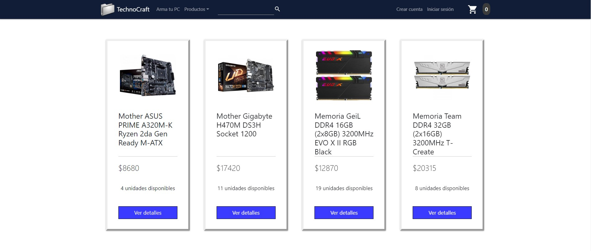

# TechnoCraft

TechnoCraft es un proyecto en desarrollo. Se trata de un E-commerce dedicado a la venta de componentes de computadora (Hardware). Esta desarrollado con HTML5, CSS3, Javascript y React Js, basado en el framework "React bootstrap"

El proyecto es una [SPA](https://developer.mozilla.org/en-US/docs/Glossary/SPA) (Simple page application) y cuenta con las siguientes opciones:

1) Menu de navegación, donde se puede acceder a las distintas categorías de productos, al carrito, y luego a la barra de búsqueda y otras funciones todavia en desarrollo. Esta funcion se logró gracias al uso de React-router-dom.

2) Vista general de la tienda, en la cual se encuentran todos los productos disponibles en la base de datos de la tienda (haya stock o no), y en la cual se muestran los datos mas relevantes, tales como el precio, el nombre, el stock y la imagen de cada producto.

3) Vista del detalle del producto, que permite saber un poco más de cada producto gracias a la descripción del mismo, y donde se puede elegir la cantidad que queramos llevar de cada producto y agregarlo a nuestro carrito.

4) Vista del carrito, donde se pueden observar los productos elegidos por el cliente, la cantidad por la que optó, el precio individual de cada item y el precio en total. Además, hay un breve resumen de los precios de todos los productos elegidos junto con impuestos y posibles descuentos de temporada. También se puede borrar todo el carrito o borrar uno a uno cada producto no deseado.

## Construido con 

- [Bootstrap] para dar forma al proyecto (https://shields.io/)
- [React Router Dom] para la navegación del mismo(https://shields.io/)

